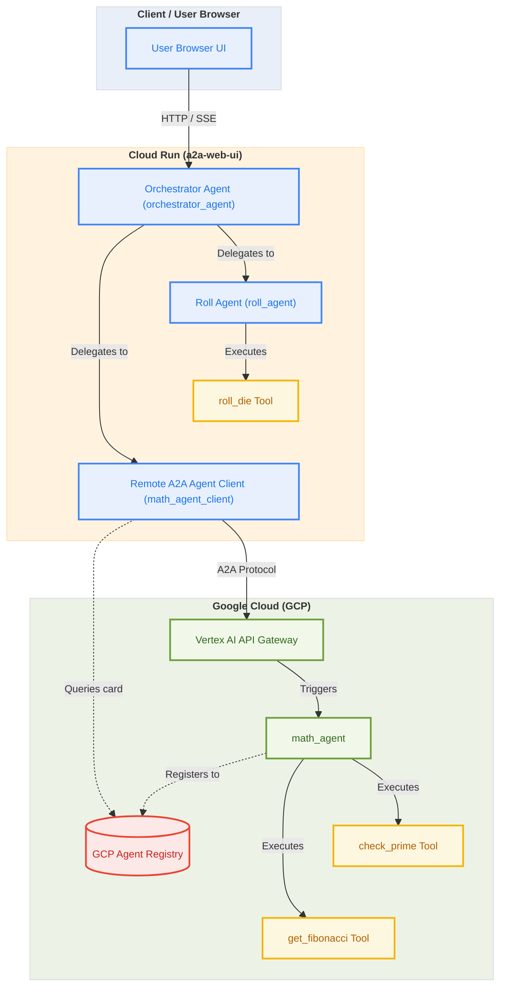

# google-adk-a2a-sample

A sample agent built with Google ADK and A2A Protocol
Agent generated with `agents-cli` version `0.1.1`

## Project Structure

```
google-adk-a2a-sample/
├── app/         # Core agent code
│   ├── agent.py               # Main agent logic
│   ├── agent_runtime_app.py    # Agent Runtime application logic
│   └── app_utils/             # App utilities and helpers
├── tests/                     # Unit, integration, and load tests
├── GEMINI.md                  # AI-assisted development guide
└── pyproject.toml             # Project dependencies
```

> 💡 **Tip:** Use [Gemini CLI](https://github.com/google-gemini/gemini-cli) for AI-assisted development - project context is pre-configured in `GEMINI.md`.

## Requirements

Before you begin, ensure you have:
- **uv**: Python package manager (used for all dependency management in this project) - [Install](https://docs.astral.sh/uv/getting-started/installation/) ([add packages](https://docs.astral.sh/uv/concepts/dependencies/) with `uv add <package>`)
- **agents-cli**: Agents CLI - Install with `uv tool install google-agents-cli`
- **Google Cloud SDK**: For GCP services - [Install](https://cloud.google.com/sdk/docs/install)


## Quick Start

Install required packages:

```bash
agents-cli install
```

Test the agent with a local web server:

```bash
agents-cli playground
```

You can also use features from the [ADK](https://adk.dev/) CLI with `uv run adk`.

## Commands

| Command              | Description                                                                                 |
| -------------------- | ------------------------------------------------------------------------------------------- |
| `agents-cli install` | Install dependencies using uv                                                         |
| `agents-cli playground` | Launch local development environment                                                  |
| `agents-cli lint`    | Run code quality checks                                                               |
| `uv run pytest tests/unit tests/integration` | Run unit and integration tests                                                        |
| `agents-cli deploy`  | Deploy agent to Agent Runtime                                                                |
| `agents-cli publish gemini-enterprise` | Register deployed agent to Gemini Enterprise                    |

## 🛠️ Project Management

| Command | What It Does |
|---------|--------------|
| `agents-cli scaffold enhance` | Add CI/CD pipelines and Terraform infrastructure |
| `agents-cli infra cicd` | One-command setup of entire CI/CD pipeline + infrastructure |
| `agents-cli scaffold upgrade` | Auto-upgrade to latest version while preserving customizations |

---

## Architecture

The project can be run locally for development or deployed fully to Google Cloud Platform. 

- **Math Agent (`math_agent`):** Deployed to Google Cloud Agent Runtime (Vertex AI Agent Engine).
- **Orchestrator Agent (`orchestrator_agent`):** Bundled into a FastAPI web application and deployed to **GCP Cloud Run** (or run locally via `uvicorn`). It communicates with the GCP-hosted Math Agent via A2A protocol.

### Multi-Agent Architecture (Cloud Run Topology)



### Step 1: Scaffold & Configure
The project is configured to separate local and remote agents into different directories to avoid mixing code:
- **Local Agents:** Defined under `app/`.
- **Remote Agent:** Defined under `remote_agent/`.

We configure the package layout in `pyproject.toml` to only bundle `remote_agent` when building/deploying (excluding the `app/` folder):
```toml
[tool.setuptools]
packages = ["remote_agent"]

[tool.agents-cli]
agent_directory = "remote_agent"
region = "us-central1"

[tool.agents-cli.create_params]
deployment_target = "agent_runtime"
is_a2a = true
```

The remote entrypoint in `remote_agent/agent_runtime_app.py` exposes the `agent_runtime`:
```python
agent_runtime = AgentEngineApp(
    agent_card=agent_card,
    agent_executor_builder=create_agent_executor,
)
```

To resolve model 404 errors inside Vertex AI, the remote agent imports `Gemini` and overrides the `api_client` using a custom class to force client calls to the `global` location:
```python
class GlobalGemini(Gemini):
    @cached_property
    def api_client(self) -> Client:
        return Client(vertexai=True, location="global")
```

### Step 2: Deploy to GCP Agent Engine
To deploy the `math_agent`, run:
```bash
agents-cli deploy --project ninghai-ccai
```
This packages the code inside `remote_agent/` only, uploads it to Google Cloud, and deploys/updates the Vertex AI Reasoning Engine instance.

### Step 3: Publish to Gemini Enterprise Agent Registry
After deploying, register your reasoning engine agent to Gemini Enterprise. This registers the agent metadata and card to the GCP Agent Registry:
```bash
uv run agents-cli publish gemini-enterprise \
  --gemini-enterprise-app-id projects/840328373082/locations/global/collections/default_collection/engines/agentspace-demo_1755656203869 \
  --display-name math_agent \
  --description "A remote agent specialized in checking prime numbers and generating Fibonacci sequences." \
  --registration-type adk
```

### Step 4: Dynamic Registry Discovery in Consumer Agent
Instead of hardcoding the `AgentCard` locally, the consumer agent looks up the remote agent dynamically from the GCP Agent Registry at runtime using the `AgentRegistry` client:

```python
from google.adk.integrations.agent_registry import AgentRegistry

# Initialize registry client
registry = AgentRegistry(project_id="ninghai-ccai", location="us-central1")

# Retrieve math_agent dynamically from GCP Agent Registry
def get_math_agent_client() -> RemoteA2aAgent:
    agents = registry.list_agents(page_size=100).get("agents", [])
    for a in agents:
        if a.get("displayName") == "math_agent":
            return registry.get_remote_a2a_agent(
                a.get("name"),
                httpx_client=create_authenticated_client(),
            )
    raise RuntimeError("math_agent not found in GCP Agent Registry")

math_agent_client = get_math_agent_client()
```

### Step 5: Run Local Consumer Agent
Now, run your local consumer agent:
```bash
uv run adk run app "roll a 6-sided die and check if it's prime"
```
It will roll the die locally using `roll_agent`, and call the dynamically discovered `math_agent` deployed on GCP over A2A to check the result.

### Step 6: Deploy Orchestrator Web UI to GCP Cloud Run

The orchestrator and Web UI can be containerized and run on Google Cloud Run to provide a hosted, fully functional Sandbox interface.

1. **Service Account Permissions**:
   The service account running the Cloud Run service needs the **Agent Registry Viewer** (`roles/agentregistry.viewer`) IAM role to dynamically fetch cards from the GCP Agent Registry:
   ```bash
   gcloud projects add-iam-policy-binding ninghai-ccai \
       --member="serviceAccount:<PROJECT_NUMBER>-compute@developer.gserviceaccount.com" \
       --role="roles/agentregistry.viewer"
   ```

2. **Required Environment Variables**:
   To authenticate calls to the Vertex AI A2A reasoning engine without specifying API keys, the service must run with the following environment variables:
   * `GOOGLE_GENAI_USE_VERTEXAI=TRUE`
   * `GOOGLE_CLOUD_LOCATION=global`

3. **Deployment Script**:
   Deploy the service to Cloud Run by running:
   ```bash
   ./deploy_cloud_run.sh
   ```
   This script triggers Cloud Build to compile a Docker image using the `Dockerfile` with the astral `uv` cache, uploads it to Artifact Registry, and deploys it to Cloud Run with 1GB memory.

Once complete, it will output the service URL (e.g., `https://a2a-web-ui-840328373082.us-central1.run.app`).


## Observability

Built-in telemetry exports to Cloud Trace, BigQuery, and Cloud Logging.
